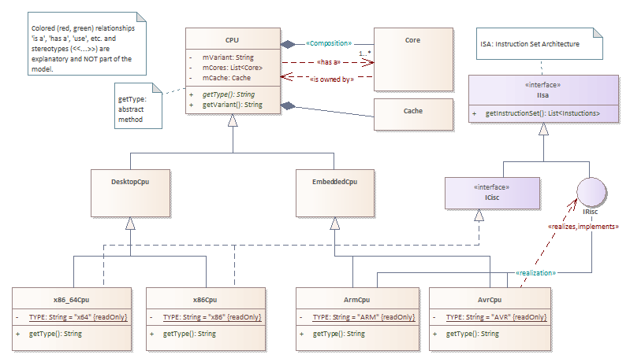

W01 - Assignment: Computers
==================
Implementation of an OOP-Model given in UML in Java
---------------------------------------------------

In this assignment the basic Java language elements shall be used to realize a UML as shown in the class diagrams below.

### Goal
Getting familiar with Java language constructs.
The implementation of the specified entities (classes, interfaces, enumerations, etc.) and their relationship.
In addition, class properties, visibility specifiers, accessor methods (getter, setter), static, and abstract methods and properties shall be used.
A specific purpose of the application as such is not in scope.

### Assignment
1. Implement the UML model as shown in the diagrams below in Java using the correct language constructs (classes, interfaces, ...).
Consider the attribution (visibility, static, abstract, ...) of several properties and methods.
Hint: '~' denotes 'package' visibility.
1. Ensure, that values for all shown properties can be applied and read, even if those setters / getters are not shown in the diagram. It is fine and even wanted, if some of these properties can be accessed on some class levels (e.g. base class, leaf classes) only.
1. Implement a 'toString' method for all classes. The following information shall be printed:
    + The hash-code of the object
    + Compile time name of a class: '&lt;Class>.class.get&lt;XY>Name()', where &lt;class> is the name of the class in which 'toString' is implemented (static access) and &lt;XY> stands for 'Simple', 'Canonial' or '' (empty). Use different 'getName' methods in different classes to see the difference.
    + Runtime name of the class: The name of the runtime type can be determined using 'getClass().get&lt;XY>Name()' (see above). Use different 'getName' method in different classes to see the difference.
    + All class properties (including inherited) and their values
1. Implement 'hashCode' and 'equals' for class 'Pc' and all it's sub-classes. PCs shall be equal if all their properties are equal. The hash-code of equal properties shall be equal as well.
Hint: Most IDEs have code generators for these methods. You can use them but try to understand the generated code.
1. Try to access inaccessible properties (e.g. protected or package properties from other classes) - this shall lead to compile errors (which ones?). Comment these code lines and add a comment describing the error.
1. Implement a 'main' method, in which multiple, different Computers including associated objects such as 'Core's are instantiated.
    + Use an array of 'Computers' to store those instances.
    + Iterate through this array and print all items  
        ` // Hint:`   
        `    for(Computer computer : computers) { ... }`
    + Create a few instances of PC's with equal attributes. Print a marker whether or not consequent array items are equal in the loop requested above.
1. Add some other features as you wish.

#### UML Model for the basic classes

All entities shown in this diagram shall be placed in the root package (however this is called).

#### UML Model for package 'devices'

All entities shown in this diagram shall be placed in package 'devices', which is a sub-package of your root package.

Hints:
- Method 'getType' shall be abstract within the base class 'Cpu'. The concrete type of a specific CPU shall be defined as static property within the according specific class (see TYPE). That class shall implement the method 'getType' by returning the value of its TYPE property.
- There shall be NO setter for 'getVariant' within the class hierarchy of class 'Cpu'.
- For interfaces both - the rectangular and the bubble notation - are used. The way of implementation is the same, regardless of the UML notation.